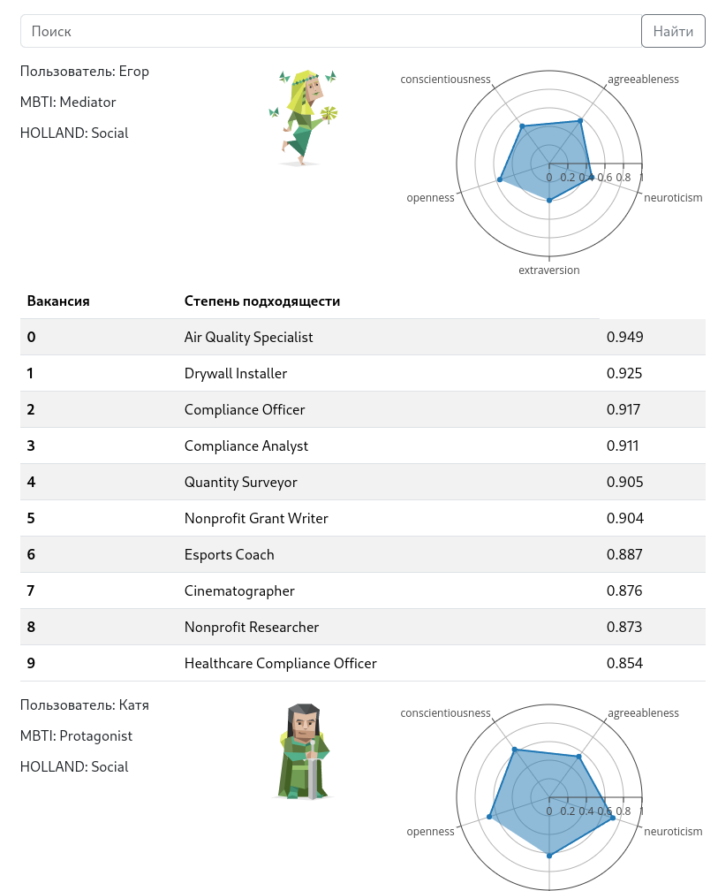
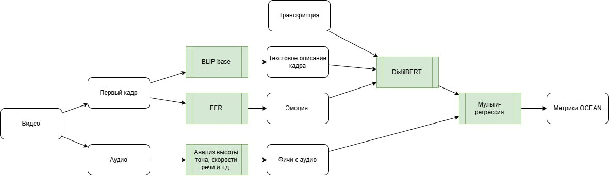

# Подбор кандидатов на вакансию по типу личности

## Содержимое

- [Превью](#превью)
- [Описание задачи](#описание-задачи)
- [Решение](#решение)
- [Файловая структура](#файловая-структура)
- [Запуск](#запуск)

## Превью



[Скринкаст](https://disk.yandex.ru/i/Kz7Wns61ZhVwYg)

## Описание задачи

Современный рынок труда сталкивается с трудностями в подборе кандидатов, чьи личные качества и профессиональные особенности соответствуют требованиям вакансии. Несоответствие типа личности кандидата и специфики профессии приводит к текучести кадров и увеличивает расходы на поиск подходящих специалистов. В то же время многие кандидаты испытывают неопределенность в выборе карьерного пути. Использование современных технологий анализа данных и искусственного интеллекта может стать ключом к решению этих проблем.

Участникам предлагается разработать систему, которая по видеовизитке кандидатов определяет их тип личности и соотносит его с требованиями вакансии. Система должна предлагать работодателям список наиболее подходящих кандидатов, а соискателям – возможность проанализировать свои видеовизитки на тип личности. Решение должно включать модель оценки типа личности по видеоматериалу и графический интерфейс, позволяющий кандидатам загружать свои видеовизитки для анализа, а работодателям – получать список кандидатов для определенной профессии.

## Решение

Решение описано в [презентации](./presentation.pdf).



## Файловая структура

```bash
.
├── docker-compose.yml
├── front                       -- Фронтенд
│   └── kali_front
├── new_back                    -- Бекенд
│   └─ hope_bert                   -- Так будут выглядеть веса для регрессора после распаковки 
│       ├── hope
│       ├── special_tokens_map.json
│       ├── tokenizer_config.json
│       ├── tokenizer.json
│       └── vocab.txt
│   ├── config.py
│   ├── db.py
│   ├── dependencies.py
│   ├── Dockerfile
│   ├── full_pipeline.py
│   ├── get_plots.py
│   ├── main.py                 -- Скрипт для запуска бекенда
│   ├── models.py               -- Схема базы данных
│   ├── requirements.txt        -- Зависимости
│   ├── schemas.py
│   ├── jobs.csv                -- Заготовленные OCEAN теги для 500 профессий
│   ├── search_faiss.py         -- Реализация поиска в faiss
│   ├── service.py
│   ├── static                  -- Статические файлы для сайта
│   ├── test_add.py             -- Скрипт для формирования бд
│   └── views.py                -- Эндпоинты для api
├── ml                          -- Отдельные файлы, реализующие ML модели
│   ├── full_pipeline.py        -- Полный pipeline обработки данных
│   ├── BertRegressor.ipynb     -- Обучение классификатор
│   └── model_regressor.py      -- Регрессор
├── package-lock.json
└── Readme.md
```

### Запуск

Скачайте веса из [гугл диска](https://drive.google.com/drive/folders/1oIzjtfrKbJUywuRx4xgDNAQkLsF2xgGI?usp=sharing) в папку new_back/hope_bert

Фронтенд:

```bash
Перейдите в директорию front/kali_front

В api.js и компонентах из папки views изменить IP адрес сервера с бекендом

docker build --tag 'front' .
docker run -p 0.0.0.0:5173:5173 front
```

Бекенд:

```
Перейдите в директорию new_back
Убедитесь, что в этой директории находится папка hope_bert

требуется python3.10

python3.10 -m venv venv
source ./venv/bin/activate

python -m pip install -r requirements.txt

uvicorn main:app --host 0.0.0.0 --port 8000
```

Перейдите в браузер [http://localhost:5173](http://localhost:5173)

Или зайдите на уже запущенный сервер

http://213.171.28.36:5173/
